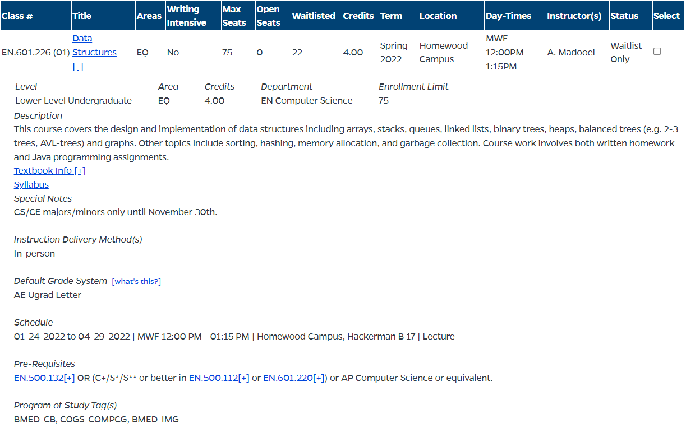

# Semester.ly Technical Challenge (Backend)

## How to build

1. It is suggested that you are on Python 3.8+, but lower minor versions may also work.
2. Create a virtual environment with the following command: `python3 -m venv venv`

- This allows you to install dependencies in a local area so that it doesn't impact
  other applications.

3. Enter the virtual environment: `source venv/bin/activate`
4. Install dependencies: `pip install -r requirements.txt`
5. Run the server: `python manage.py runserver`

Please ask for help in the Discord's #challenge-help channel if you are having issues
building the project.

## Django Overview

If you are unfamiliar with Django, reading this
[section](https://developer.mozilla.org/en-US/docs/Learn/Server-side/Django/Introduction#what_does_django_code_look_like)
might help with understanding the framework's architecture. Note that in this codebase,
there are no HTML templates because we are using Django purely as a REST API.

## The Existing Codebase

### The Course Model

There is an existing Django model named Course in the [timetable/models.py](timetable/models.py) file. This class is
a very basic representation of a college course and has three fields:

1. The course's _name_
2. The course's _code_
3. The course's number of _credits_

```python
class Course(models.Model):
    """A course that students can take at Hopkins."""
    name = models.CharField(max_length=100)
    code = models.CharField(max_length=15, unique=True)
    credits = models.DecimalField(max_digits=2, decimal_places=1)
```

In this simplified model, the course's _code_ is a _primary key_, essentially meaning it
uniquely identifies the course.

Take the following course as an example:



The fields would be as follows:

```
Course:
    Name: Data Structures
    Code: EN.601.226
    Credits: 4
```

### The Course Serializer

There is a serializer for the Course model in [timetable/serializers.py](timetable/serializers.py), which converts a Django model into a Python
dictionary similar to JSON.

```python
class CourseSerializer(serializers.Serializer):
    name = serializers.CharField(max_length=100)
    code = serializers.CharField(max_length=15)
    credits = serializers.DecimalField(max_digits=2, decimal_places=1)
```

Example usage:

```python
>>> CourseSerializer(course).data
{
    "name": "Data Structures"
    "code": "EN.601.226",
    "credits": "4.0",
}
```

### The GET `/courses/all` endpoint

This endpoint returns a list of all of the courses in JSON format using the serializer
defined above. The endpoint is defined in [timetable/urls.py](timetable/urls.py), while
the View that handles the endpoint is defined in [timetable/views.py](timetable/views.py).

You can test it for yourself by using [Postman](https://www.postman.com/) and making a
GET call to `localhost:8000/courses/all`, but this is not required. Postman is a web
development tool that allows you to easily make API calls.

> GET localhost:8000/courses/all

```json
[
  {
    "name": "Intermediate Programming",
    "code": "EN.601.220",
    "credits": "4.0"
  },
  {
    "name": "Data Structures",
    "code": "EN.601.226",
    "credits": "4.0"
  }
]
```

### Tests

There are two tests given to you in [timetable/tests.py](timetable/tests.py). These
verify that the serializer and GET endpoint work as expected.

You can run the tests with the following command: `python3 manage.py test`

You are encouraged to add tests for any endpoints that you may write for this challenge.

## Extra

A useful command to enter a Python interactive shell connected to the server is `python3
manage.py shell`. You can manually access, add, and remove Courses in this shell if you so desire.

Remember that you can and should ask additional questions in the Discord's
#challenge-help channel if anything remains unclear.
