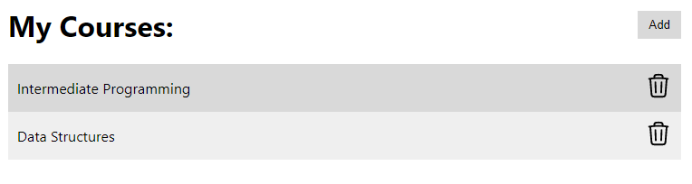
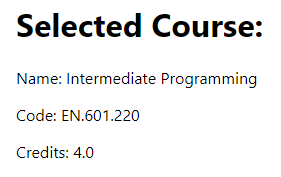

# Semester.ly Technical Challenge (Frontend)

## How to build

As the frontend requires data from the backend, we suggest building the backend first.

1. It is suggested that you are on node 16+, but lower even major versions may also
   work.
2. Install dependencies: `npm i`
3. Run the server: `npm start`

Please ask for help in the Discord's #challenge-help channel if you are having issues
building the project.

## Overview

If you are unfamiliar with any of TypeScript, React, or Redux, consider taking a look at
the following resources:

1. TypeScript

- It's JavaScript with type annotations, which lets us know what the type of
  variables, arguments, and return types are. It's useful because it "documents" the
  code, making it easier to read and understand.
- [Main site](https://www.typescriptlang.org/)
- [Cheatsheets](https://www.typescriptlang.org/cheatsheets)

2. React

- React is a library we use to create the components that you see on the site. It
  handles changes of visible information, so that the things you see can change
  without you having to refresh the page.
- [Main site](https://reactjs.org/)
- [Controlled components](https://reactjs.org/docs/forms.html#controlled-components)
- [React hooks (functional components)](https://reactjs.org/docs/hooks-intro.html)

3. Redux

- Redux is a library which handles the state, or internal information behind the scenes.
  It follows a strict pattern to ensure that modifying data is predictable and less
  error-prone, usually saving time that you would spend on debugging. React-Redux connects the information in Redux to the components in React.
- [Main site](https://redux.js.org/)
- [Redux overview](https://redux-toolkit.js.org/introduction/getting-started#learn-redux)
- [React-Redux](https://react-redux.js.org/introduction/getting-started#hooks)
- [Redux Toolkit](https://redux-toolkit.js.org/tutorials/quick-start)

## The Existing Codebase

### Course List

[src/components/CourseList.tsx](src/components/CourseList.tsx)

This React component receives a list of courses as props (like args for React) and
displays them. It is also where the button to add a course lives.

### Course Tab

[src/components/CourseTab.tsx](src/components/CourseTab.tsx)

This React component represents a single course. In other words, the CourseList renders
a list of CourseTabs.

### Course Details

[src/components/CourseDetails.tsx](src/components/CourseDetails.tsx)

This React component displays information about the selected course.

### Add Course Modal

[src/components/AddCourseModal.tsx](src/components/AddCourseModal.tsx)

This is the popup that appears to add a course when you click on the "Add" button.

### Course Slice

[src/state/slices/courseSlice.ts](src/state/slices/courseSlice.ts)

This is the Redux slice that stores the state relating to courses. It handles fetching the
courses from the server and storing it in the frontend.

Additional comments are left for you in the codebase to explain what is going on
internally.

## Extra

We've kept the CSS minimal for this challenge so that you wouldn't have to worry about
it too much, but if you want to demonstrate that you have extensive knowledge of CSS,
you are welcome to re-skin the UI to be more appealing.

Remember that you can and should ask additional questions in the Discord's
#challenge-help channel if anything remains unclear.
